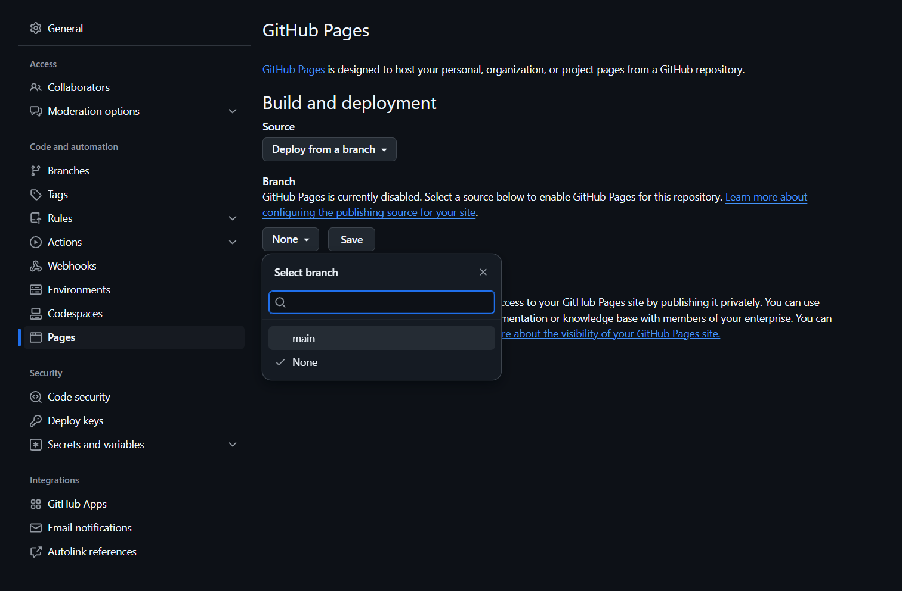

# GitHub Pages Demo


A simple demonstration of a static webpage using HTML, CSS, and JavaScript, hosted on GitHub Pages. This project shows how to create an interactive webpage with basic styling and JavaScript functionality.

## 🔴 Live Demo

Visit the live demo: [https://argonaut790.github.io/example-github-io/](https://argonaut790.github.io/example-github-io/)

## 🚀 Features

- Responsive design
- Interactive color-changing box
- Clean and modern UI
- Separated HTML, CSS, and JavaScript files
- Mobile-friendly layout

## 📁 File Structure

```
/
├── index.html      # Main HTML file
├── styles.css      # CSS styles
├── script.js       # JavaScript functionality
└── README.md       # Project documentation
```

## 🛠️ Technologies Used

- HTML5
- CSS3
- JavaScript
- GitHub Pages

## 🎯 Purpose

This repository serves as an example of:
- How to structure a basic web project
- How to separate concerns (HTML, CSS, JavaScript)
- How to deploy a website using GitHub Pages
- Basic interactive web functionality

## 📝 How to Use

### Local Development

1. Clone the repository:
   ```bash
   git clone https://github.com/YOUR-USERNAME/REPOSITORY-NAME.git
   ```

2. Open the project in your code editor

3. Open `index.html` in your browser to view the site

### Deploy to GitHub Pages

1. Create a new repository on GitHub
2. Upload all files to your repository
3. Go to Settings > Pages

4. Select your main branch as the source

5. Wait a few minutes for deployment
6. Visit your site at `https://YOUR-USERNAME.github.io/REPOSITORY-NAME`

## 💡 Customization

You can customize this template by:
- Modifying colors in `styles.css`
- Adding new JavaScript functions in `script.js`
- Updating content in `index.html`
- Adding new features or sections

## 📚 Learning Resources

- [GitHub Pages Documentation](https://docs.github.com/en/pages)
- [HTML MDN Documentation](https://developer.mozilla.org/en-US/docs/Web/HTML)
- [CSS MDN Documentation](https://developer.mozilla.org/en-US/docs/Web/CSS)
- [JavaScript MDN Documentation](https://developer.mozilla.org/en-US/docs/Web/JavaScript)

## 🤝 Contributing

Feel free to fork this repository and create your own version. If you have suggestions for improvements, please open an issue or submit a pull request.

## 📄 License

This project is open source and available under the [MIT License](LICENSE).